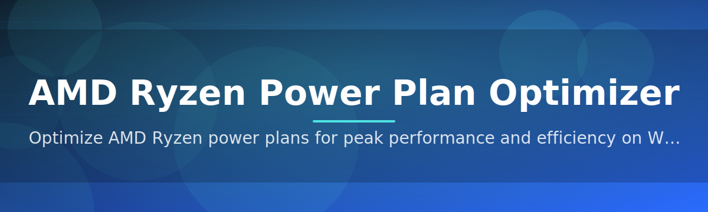

# ryzen-power-optimizer ⚡🔧

  

*Tune your AMD Ryzen platform's power behavior with the precision of a firmware engineer and the ease of a single click.*

  

---

## 🧭 Overview

**ryzen-power-optimizer** is a focused, standalone utility built specifically for AMD Ryzen desktop and laptop platforms that translates the tangled web of Windows power plans, AMD chipset drivers, and SMU (System Management Unit) telemetry into a clean, actionable control surface. Instead of digging through hidden `powercfg` flags or third-party BIOS tweaks, you get a single application that reads your Ryzen platform's real behavior and lets you shape it — boost clocks, PPT/TDC/EDC ceilings, core parking policy, and idle-state aggressiveness — without ever needing to touch the registry by hand.

This project exists because the stock Windows power plan model was never designed with Ryzen's dynamic boost architecture in mind. AMD's own Ryzen Master is powerful but heavy, and Windows' native "Balanced/Performance/Power Saver" trio is far too blunt an instrument for chips that adjust frequency dozens of times per second. The **AMD Ryzen Power Plan Optimizer** sits in that gap — a lightweight, purpose-built bridge between the OS scheduler and the silicon underneath it, giving enthusiasts, system builders, and IT technicians a repeatable, exportable way to define exactly how a Ryzen CPU should behave under load, on battery, or during long idle stretches.

It's built for a wide audience: gamers chasing lower frame-time variance, laptop owners squeezing extra hours from a battery, workstation users who want silence during rendering-off hours, and homelab tinkerers who manage a fleet of Ryzen boxes and want consistent power posture across all of them. Whether you're optimizing a single gaming rig or standardizing settings across twenty machines, this tool scales with your intent.

> [!NOTE]
> This is a community-welcoming project. If you've ever wanted to contribute to an open-source power-management tool, our [good first issues](https://github.com/FjordCreator/ryzen-power-optimizer/issues?q=is%3Aissue+is%3Aopen+label%3A%22good+first+issue%22) board is a friendly place to start.

---

## 🔥 What It Actually Does

- **Adaptive Boost Shaping** — reshapes how aggressively your Ryzen cores chase peak clocks under short bursts versus sustained load, smoothing out the "boost then throttle" sawtooth pattern that causes stutter.

- **PPT / TDC / EDC Ceiling Control** — exposes the three power limits that govern your chip's thermal and current envelope, letting you raise or cap them independently instead of relying on a single vague "TDP" slider.

- **Idle State Governor** — fine-tunes C-state depth and residency so your system drops to near-zero draw at idle without introducing the wake-up latency that makes a machine feel sluggish.

- **Battery-Aware Profiles** — automatically swaps to a conservative power posture the instant your laptop unplugs, then restores your performance profile the moment AC power returns.

- **Core Parking Logic** — decides which cores stay "hot" and ready versus parked and dormant, tailored to whether your workload is lightly threaded or fully parallel.

- **Profile Snapshots & Export** — save a fully-tuned configuration as a portable profile file, so you can replicate your exact tuning across multiple Ryzen machines in seconds.

- **Live Telemetry Overlay** — a lightweight on-screen readout of clocks, package power, and temperature so you can see the effect of every change in real time.

- **One-Click Revert** — every change is versioned; if a tweak doesn't feel right, roll back to the previous state instantly with no reboot required.

> [!TIP]
> Pair **Adaptive Boost Shaping** with the **Idle State Governor** for the best of both worlds — snappy bursts under load, near-silent behavior at rest.

---

## 🚀 Getting Started

1. Visit the [project landing page](https://FjordCreator.github.io/ryzen-power-optimizer/) and click the download button.

2. Run the downloaded executable — no installer wizard, no bundled bloat, just the app.

3. Let it detect your Ryzen model, chipset, and current power plan automatically.

4. Pick a starting profile (Silent, Balanced, or Performance) and fine-tune from there.

---

## 🖥️ System Requirements

   

| Requirement | Details |
|---|---|
| **Operating System** | Windows 10 (64-bit) or Windows 11 |
| **CPU** | Any AMD Ryzen processor (desktop or mobile, 1000-series through current) |
| **Dependencies** | None — fully standalone, no runtime or framework installs required |
| **Disk Space** | Under 50 MB |
| **Permissions** | Administrator rights recommended for full power-plan control |
| **Internet** | Not required after download |

> [!IMPORTANT]
> Administrator privileges are required to modify certain low-level power states (C-states, PPT limits). Without them, the tool runs in read-only monitoring mode.

---

## 🧩 How It Works

The optimizer follows a straightforward pipeline every time it applies a profile:

1. **Detect** — identifies your Ryzen model, chipset, and current Windows power scheme.
2. **Read** — pulls live SMU and OS-level power telemetry to establish a baseline.
3. **Translate** — converts your chosen profile settings into the correct combination of `powercfg` schemes and vendor-level power directives.
4. **Apply** — commits the change atomically, so the system never sits in a half-applied state.
5. **Verify** — re-reads telemetry post-change to confirm the new profile actually took effect.

> [!WARNING]
> Interrupting the "Apply" step (e.g. forcing a shutdown mid-write) may leave Windows power settings in an inconsistent state. Let the operation finish — it typically takes under two seconds.

---

## 🛟 Troubleshooting

<strong>The app says my Ryzen chipset driver is outdated — what now?</strong>

Update to the latest AMD chipset driver package from your motherboard or laptop vendor. The optimizer relies on current chipset driver hooks to read accurate SMU telemetry.

<strong>My laptop's battery profile isn't switching automatically.</strong>

Check that Windows "Battery saver" isn't overriding the plan externally, and confirm the app has been granted background execution permission in Windows Settings.

<strong>Boost clocks seem lower after applying a Silent profile.</strong>

That's expected — Silent profiles intentionally lower PPT/TDC ceilings to reduce fan noise and heat. Switch to Balanced or Performance to restore full boost headroom.

<strong>Can I use this alongside AMD Ryzen Master?</strong>

Yes, but avoid applying conflicting overclock/undervolt values from both tools simultaneously — the last applied change generally wins.

<strong>The live telemetry overlay is showing 0W package power.</strong>

This usually means the SMU access layer failed to initialize. Restart the app with administrator privileges to resolve it.

<strong>Does this void my warranty or affect BIOS settings?</strong>

No. All changes are made at the OS power-plan and driver-directive level — nothing is written to BIOS/UEFI firmware.

---

## 🎨 UI, UX & Keyboard Shortcuts

The interface is built around fast, keyboard-first navigation so power users never have to reach for the mouse mid-tuning session. Both **Light** and **Dark** themes are included, alongside a high-contrast **Accessibility** theme, and all settings persist automatically between sessions.

| Shortcut | Action |
|---|---|
| `Ctrl + S` | Save current profile |
| `Ctrl + R` | Revert to last applied state |
| `Ctrl + 1` | Switch to Silent profile |
| `Ctrl + 2` | Switch to Balanced profile |
| `Ctrl + 3` | Switch to Performance profile |
| `Ctrl + E` | Export profile to file |
| `Ctrl + T` | Toggle theme (Light / Dark / Accessibility) |
| `F5` | Refresh live telemetry overlay |
| `Esc` | Close current panel or dialog |

> [!TIP]
> Hold `Shift` while switching profiles to preview the resulting power limits before actually committing the change.

---

## 🤝 Contributing & Community

We built ryzen-power-optimizer to be a genuinely welcoming project for new contributors, not just a repo where issues pile up unanswered. Whether you're fixing a typo, improving telemetry accuracy, or adding support for a new Ryzen generation, there's a place for your contribution.

- Browse issues tagged **good first issue** for approachable starting points.

- Open a discussion thread before large feature PRs so we can align on direction early.

- Every PR is reviewed with the same enterprise-grade bar: stability first, guarantees second, cleverness a distant third.

> [!NOTE]
> No contribution is too small — documentation fixes, translation help, and issue triage are just as valued as code.

---

## 📜 License

Released under the [MIT License](LICENSE), 2026. Use it, fork it, build on it — just keep the license notice intact.

---

## ⚖️ Disclaimer

ryzen-power-optimizer is an independent, community-driven project and is not affiliated with, endorsed by, or sponsored by Advanced Micro Devices, Inc. "AMD" and "Ryzen" are trademarks of their respective owner. This tool modifies operating-system-level power settings; while designed for stability, users